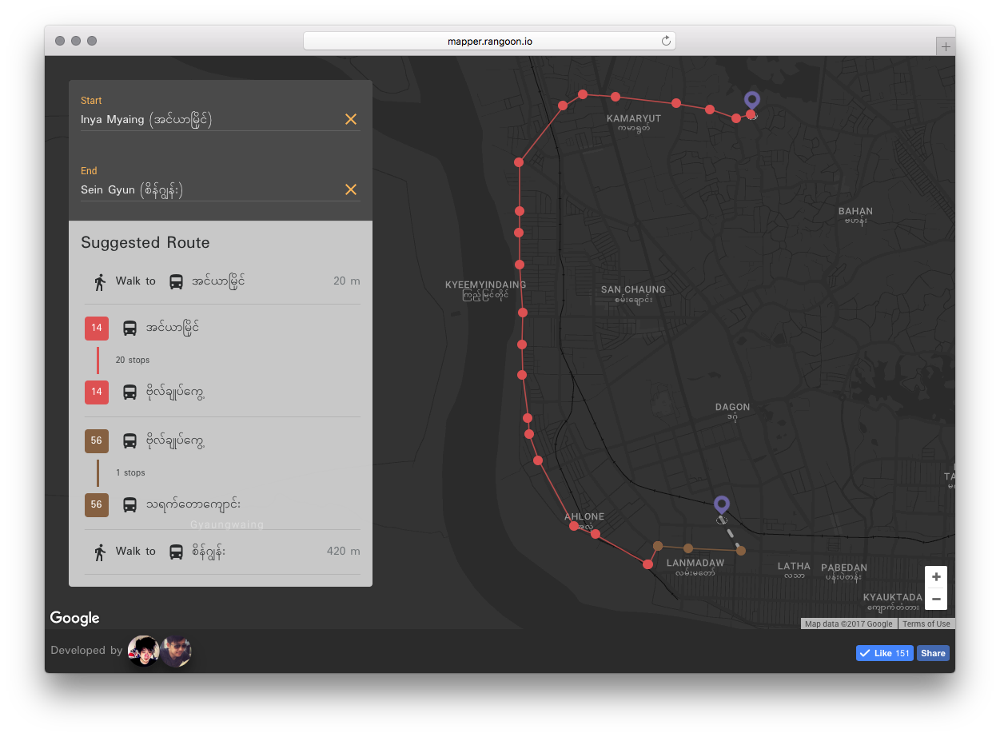
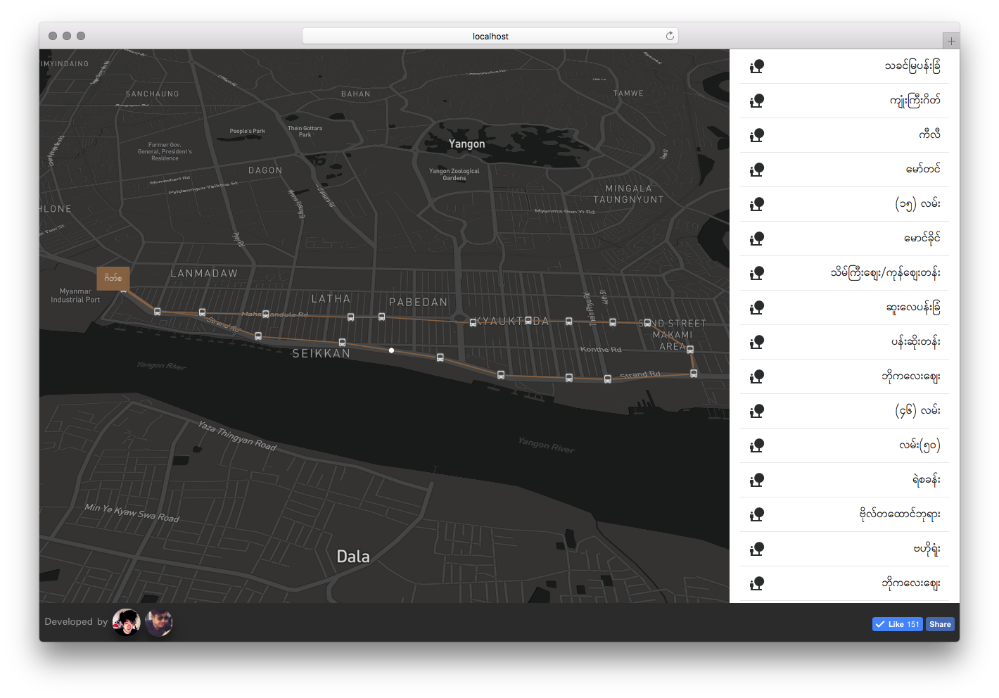

# [Rangoon Mapper](http://mapper.rangoon.io)

Rangoon Mapper aims to be the all-in-one public transportation planner for the city of [Rangoon](https://en.wikipedia.org/wiki/Yangon). This app shows all routes on the map for all bus services as well as helps you plan the journey between two bus stops. This project was initiated by [@khzaw](https://github.com/khzaw)

# Screenshots

# License
Bus stops data is available at [YangonBus](http://www.yangonbus.com) which means the data is under [YRTA Open Data License](http://data.yangonbus.com/license.html). 

Everything else is [MIT](http://cheeaun.mit-license.org/)

# Project Maintainers

* [@khzaw](https://github.com/khzaw)
* [@devmtnaing](https://github.com/devmtnaing)

# Contribution

Contributions are welcome. Take a look at issues section. Adhere to [contribution guidlines](./CONTRIBUTING.md)

# Badges

---
> [kaunghtet.xyz](http://kaunghtet.xyz) &nbsp;&middot;&nbsp;
> GitHub [@khzaw](https://github.com/khzaw) &nbsp;&middot;&nbsp;
> Twitter [@khzaw](https://twitter.com/khzaw)