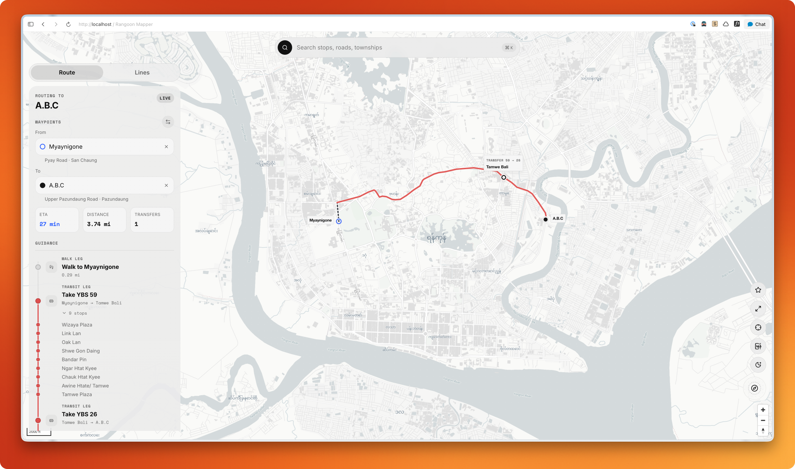
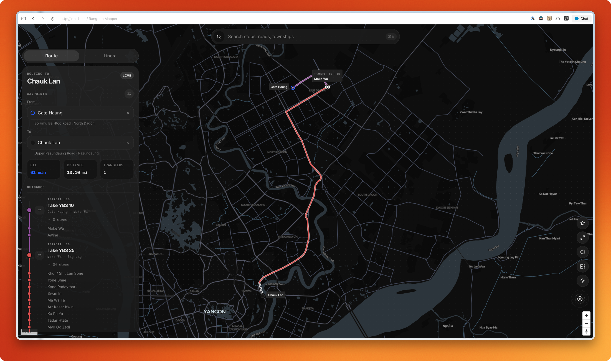
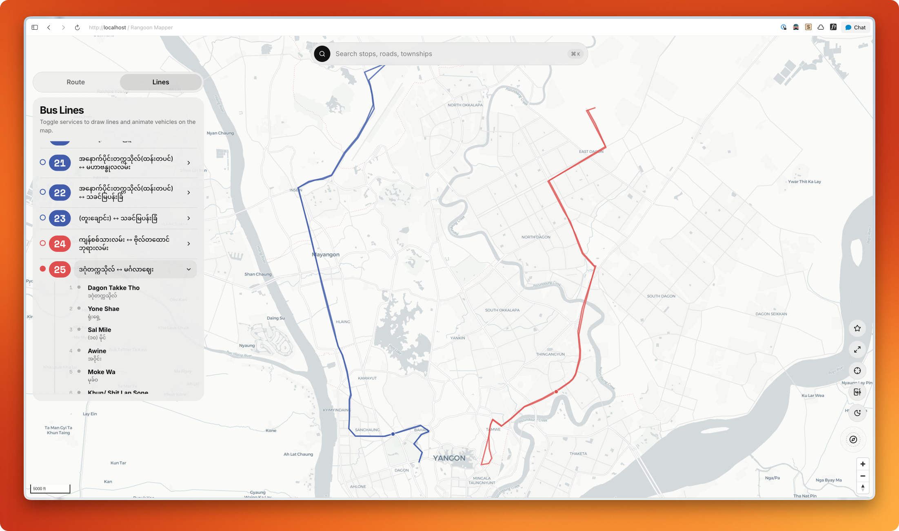
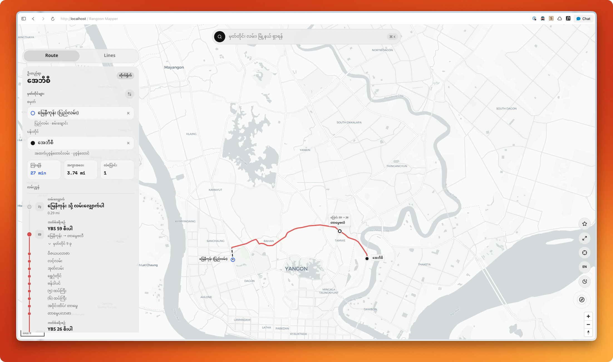

# Rangoon Mapper

[](https://github.com/projectrangoon/rangoon-mapper/actions/workflows/publish.yaml)
[](https://react.dev/)
[](https://www.typescriptlang.org/)
[](https://vite.dev/)
[](https://tailwindcss.com/)
[](#license)

Modern Yangon bus route planning and line browsing in a single React application.

Rangoon Mapper combines two workflows on one map:
- route planning between bus stops
- browsing and inspecting bus service lines

The app is built around the YRTA open data set, strict TypeScript, a full-screen MapLibre map, and a dark-first halftone UI.

Live site: [rangoonmapper.khzaw.dev](https://rangoonmapper.khzaw.dev)

## Screenshots






## Current Stack

- React 19
- TypeScript (strict)
- Vite 7
- Zustand
- React Router 7
- MapLibre GL via `react-map-gl`
- Tailwind CSS 4
- Framer Motion
- Vitest + Testing Library
- Effect

## Features

- Full-screen unified map UI for route planning and bus line browsing
- Dijkstra-based route search across connected bus services
- Animated bus line rendering with service-specific colors
- Deep links for routes and bus services
- English and Burmese locale support
- Dark-first theme with persistent theme preference
- Hoverable route stop markers and persistent transfer markers
- Docker image build and GHCR publishing workflow

## Data

This repo currently ships the app with static data under `public/data/`:

- `adjancencyList.json`
- `bus_services.json`
- `route_shapes.json`
- `stops_map.json`
- `unique_stops.json`

These files are used directly by the frontend at runtime.

## Development

### Prerequisites

- Node.js 22
- `pnpm`

### Install

```bash
pnpm install
```

### Run locally

```bash
pnpm dev
```

### Verify

```bash
pnpm lint
pnpm test:run
pnpm build
```

## Docker

Build the production image locally:

```bash
docker build -t rangoon-mapper .
```

The image serves the built SPA through `static-web-server`.

## CI

GitHub Actions runs the verification pipeline on pull requests and before image publishing on `master`.

Current CI steps:
- install dependencies with `pnpm`
- run ESLint
- run Vitest
- run the production build
- build and publish the container image to GHCR on `master`

## Project Structure

- `src/` — modern application source
- `public/data/` — runtime data files
- `crawler/` — source geometry and data extraction artifacts
- `experiment/` — legacy data prep and earlier route assets
- `app/` — legacy application retained for reference during the rewrite

## Maintainers

- [@khzaw](https://github.com/khzaw)
- [@devmtnaing](https://github.com/devmtnaing)

## Contributing

Contributions are welcome. Read [CONTRIBUTING.md](./CONTRIBUTING.md) before opening a pull request.

## License

- Bus stop and service data are provided via Yangon Bus / YRTA open data. See the [YRTA Open Data License](http://data.yangonbus.com/license.html).
- Application code in this repository is MIT licensed.
